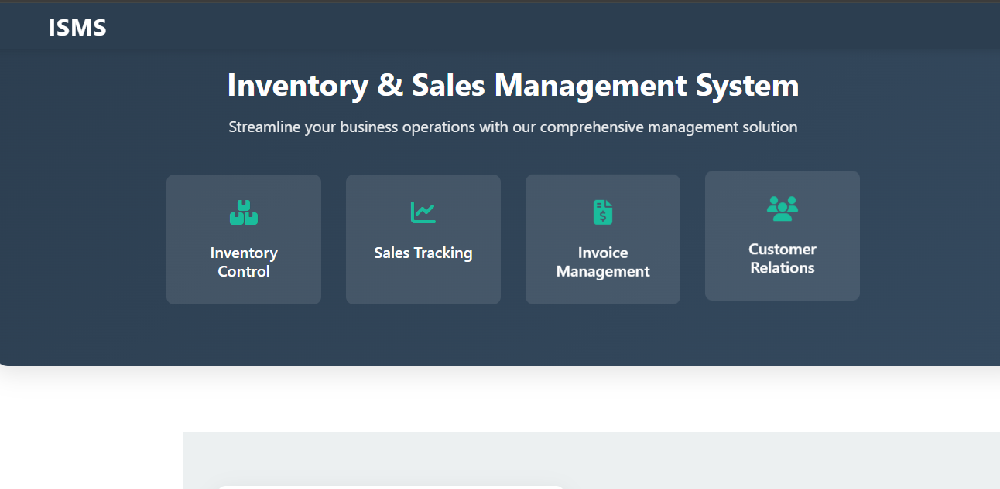
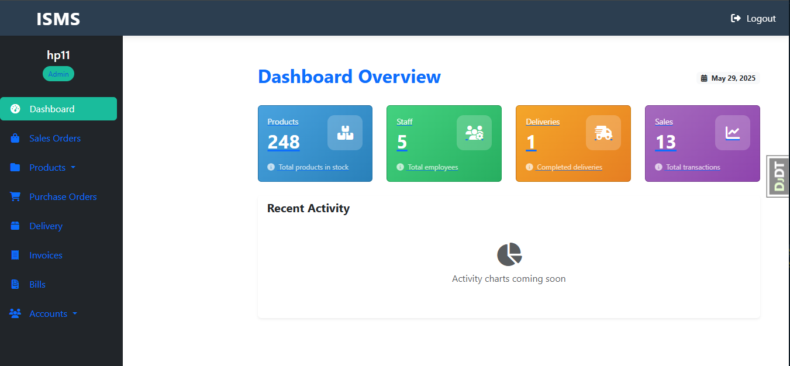
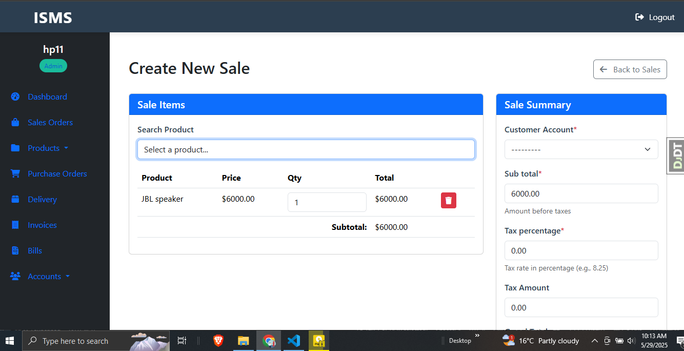
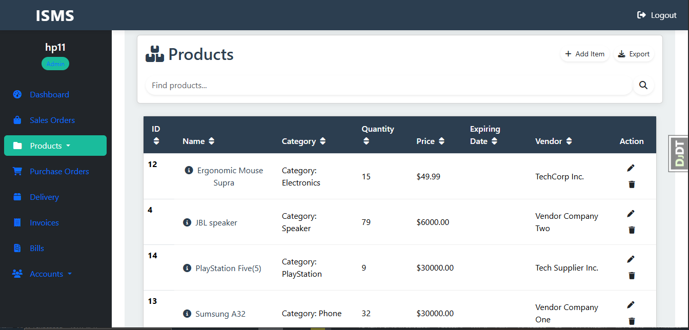

# 📦 Inventory Management System



A robust, full-featured **Inventory Management System** built with **Django**. This application provides businesses with tools to **manage products, create and track sales**, **generate invoices and bills**, and **manage employee accounts** — all secured by an authentication system.

---

## ✨ Features

- 🔐 **Authentication System**
  - User login/logout
  - Role-based access (staff/admin)
  
- 🛒 **Product Management**
  - Add, update, and delete items
  - Track item quantity and availability

- 💰 **Sales and Billing**
  - Create new sales with real-time inventory updates
  - Automatically generate invoices and bills

- 👨‍💼 **Employee Management**
  - Assign roles and access levels
  - Track employee activity and sales records

- 📊 **Dashboard**
  - View analytics, summaries, and quick access controls

---

## 🖥️ Tech Stack

- **Backend**: [Django](https://www.djangoproject.com/)
- **Database**: SQLite (can be swapped with PostgreSQL or MySQL)
- **Frontend**: HTML, CSS, Bootstrap, Django Templates
- **Authentication**: Django built-in auth system

---

|  |  |
|-----------------------------------------|---------------------------------------------|
| *Dashboard*                             | *Create Sale*                               |

|  |   |
|----------------------------------------------|-----------------------------------------|
| *Product Management*                         | *Landing Page*                           |


## 🚀 Getting Started

1. **Clone the repo**
   ```bash
   git clone https://github.com/DrLeroK/inventory_management_system.git
   cd inventory-management-system
